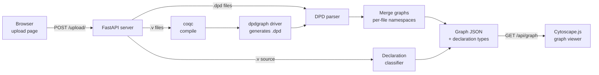

# Rocq Dependency Visualizer

A full-stack web application that turns **Rocq** (formerly Coq) proof projects into **interactive dependency graphs**. Upload source files, and the app compiles them, extracts every dependency between definitions, lemmas and theorems, and renders the result as a graph you can search, filter and export.


**[Live demo](https://rocq-dependency-visualizer.onrender.com)** · [Demo video (MP4)](assets/website-demo.mp4) · [Example files](examples/) · [How it works](#how-it-works) · [Getting started](#getting-started)

No Rocq project at hand? Download a file from [`examples/`](examples/) and upload it to the live demo. For example, `PermutationModuleGraph.dpd` shows a graph with 183 nodes right away.

> The live demo runs on Render's free tier. The first page load after a period of inactivity can take up to a minute, and the service may be paused once the monthly free quota is used up.


<details>
<summary><b>Screenshots</b></summary>
<br>
<p align="center">
  
</p>
<p align="center">
  <br>
  <em>Graph view: a selected node with its incoming (red) and outgoing (green) dependencies, in a graph of 183 nodes and 917 edges.</em>
</p>
<p align="center">
  
</p>
</details>

---

## At a Glance

| | |
|---|---|
| **Project type** | Full-stack web application: Python/FastAPI backend, vanilla JavaScript frontend |
| **Context** | Bachelor project at RPTU Kaiserslautern, winter semester 2025/26 |
| **Team** | 3 developers |
| **My role** | Backend & parsing, frontend & graph UI, project coordination ([details](#my-contributions)) |
| **Status** | Completed and publicly deployed |
| **Skills shown** | Full-stack web development · JSON APIs with FastAPI · parsing & compiler-toolchain integration · interactive data visualization · team coordination |

---

## The Problem

Rocq is an interactive theorem prover. Developers write definitions, lemmas and theorems, and Rocq checks every proof by machine. It is used in research and industry to formally verify software and mathematics.

As a proof project grows, the network of dependencies between its declarations becomes hard to see. That makes refactoring risky and makes it slow for newcomers to understand the code base. This tool automates the analysis: it extracts all dependencies and presents them as a graph that can be explored interactively.

---

## My Contributions

Within the team, I was responsible for:

- **Backend & parsing:** the FastAPI server and its endpoints, the parser for dpdgraph's `.dpd` format, the declaration-type parser for `.v` source files, and the pipeline that compiles uploaded Rocq files with `coqc` and extracts their dependency graphs.
- **Frontend & graph UI:** the upload page and the Cytoscape.js graph viewer, including layouts, search, node and edge highlighting, legend and statistics, the subgraph view, and PNG/SVG/PDF/JSON export.
- **Project coordination:** planning the work and splitting tasks across the team, aligning requirements with the supervisor, and integrating the parts into one application.

---

## Features

**Input & analysis**
- Upload `.v` (Rocq source) or `.dpd` (dependency graph) files. Several files can be uploaded at once.
- `.v` files are compiled on the server with `coqc`, and their dependency graphs are generated automatically.
- 16 declaration kinds are recognized, including `Lemma`, `Theorem`, `Definition`, `Fixpoint`, `Inductive`, `Record`, `Class` and `Axiom`.

**Exploration**
- Interactive graph powered by **Cytoscape.js**, with 11 layout algorithms (`klay`, `dagre`, `cola`, `fcose`, `cose-bilkent` and more).
- Click a node to highlight its incoming and outgoing dependencies. Open that neighborhood as a separate **subgraph** in a new tab.
- Search nodes by name or ID.
- Highlight all nodes of one declaration type, or the edges between them. Choose custom colors for Lemma, Definition and Theorem nodes.
- Switch between the whole project and a single uploaded file.
- Node and edge counts and a color legend.

**Output & usability**
- Export as **PNG, SVG, PDF or JSON**.
- Light and dark theme. The theme and the selected files survive a page reload.
- Built-in instructions page and a dedicated error page.

---

## How It Works



1. The browser sends all selected files in one multipart request.
2. `.dpd` files are parsed directly. `.v` files are compiled with `coqc`. For each compiled module, the server generates a small driver file that loads the **dpdgraph** plugin and writes the module's dependency graph as `.dpd`, which is then parsed the same way.
3. In addition, the declaration classifier scans the `.v` sources and records which names are Lemmas, Theorems, Definitions and so on. This powers the type-based highlighting in the UI.
4. The frontend fetches the merged graph as JSON and renders it with Cytoscape.js.

| Method | Endpoint | Purpose |
|--------|----------|---------|
| `GET`  | `/` | Upload page |
| `POST` | `/upload/` | Receives the files, builds the graph, redirects to the viewer (or to the error page) |
| `GET`  | `/api/graph` | Graph data and declaration types as JSON |
| `GET`  | `/visualize` | Graph viewer |
| `GET`  | `/error`, `/api/error` | Error page and the last error message |

---

## Technical Highlights

- **No build file needed for multi-file projects.** Rocq files must be compiled in dependency order. Files that fail to compile, for example because a dependency has not been compiled yet, are put back in the queue and retried up to a fixed limit. This way an upload of several interdependent files compiles without a `Makefile` or `_CoqProject`.
- **Collision-free graph merging.** dpdgraph numbers its nodes per file, so the IDs clash when several files are combined. Every node and edge ID is prefixed with its source file name before the graphs are merged.
- **Robust parsing.** The `.dpd` parser checks each line against the node/edge grammar, groups attributes, and rejects duplicate nodes and edges. The declaration classifier strips Rocq comments, including nested ones (`(* outer (* inner *) *)`), so commented-out code is not counted.
- **Rendering large graphs.** Graphs with more than 200 elements switch to a performance mode: lightweight edges, edges hidden while panning and zooming, and a force-directed default layout instead of a hierarchical one. Node size grows with the number of connections.
- **Visual encoding.** Color shows the kind of declaration (inductive type, constructor, constant). Shape shows whether a node has a body and whether it is a proposition.
- **Subgraph view without an extra API call.** The selected neighborhood is passed to the new tab with `window.postMessage` instead of being requested from the server again.

---

## Tech Stack

| Area | Technologies |
|------|--------------|
| **Backend** | Python, FastAPI (Starlette), Uvicorn, python-multipart |
| **Frontend** | Vanilla JavaScript, HTML5, CSS3 (custom properties for theming), Cytoscape.js and layout extensions (klay, dagre, cola, fcose, cose-bilkent, spread), jsPDF, qTip2 |
| **Formal methods** | Rocq/Coq compiler (`coqc`), [coq-dpdgraph](https://github.com/rocq-community/coq-dpdgraph) plugin |
| **Testing** | pytest, pytest-cov, FastAPI `TestClient` |
| **DevOps** | Docker, Docker Compose, Render (cloud hosting), Git |

---

## Getting Started

### Option 1: Docker (recommended)

The image is based on the official `coqorg/coq` image and installs the dpdgraph plugin, so `.v` compilation works out of the box.

```bash
git clone https://github.com/Devashish-Pisal/rocq-dependency-visualizer.git
cd rocq-dependency-visualizer
docker compose up --build
```

Open [http://localhost:8000](http://localhost:8000) and upload a file from [`examples/`](examples/). Stop with `docker compose down`.

### Option 2: Local Python environment

Requires Python 3.12+.

```bash
python -m venv .venv
source .venv/bin/activate          # Windows: .venv\Scripts\activate
pip install -r requirements.txt
python -m uvicorn Server:app --app-dir Backend
```

Open [http://localhost:8000](http://localhost:8000).

`.dpd` uploads work right away. Uploading `.v` files also requires the [Rocq Prover](https://rocq-prover.org/install) with `coqc` on your `PATH` and the dpdgraph plugin (`opam install coq-dpdgraph`). The layout libraries are loaded from public CDNs, so the browser needs internet access.

### Running the tests

The suite has 32 tests: unit tests for both parsers and API tests using FastAPI's `TestClient`.

```bash
pip install pytest pytest-cov httpx
PYTHONPATH=Backend python -m pytest
PYTHONPATH=Backend python -m pytest --cov=Backend --cov-report=html   # report in htmlcov/index.html
```

On Windows PowerShell, set the path first with `$env:PYTHONPATH="Backend"`. It is needed because the backend modules import each other by name.

---

## Project Structure

```
rocq-dependency-visualizer/
├── Backend/
│   ├── Server.py           # FastAPI app: routes, upload handling, coqc + dpdgraph pipeline
│   ├── Parser.py           # Parser for dpdgraph's .dpd format
│   └── RocqParser.py       # Classifies declarations (Lemma, Theorem, ...) in .v sources
├── Frontend/
│   ├── index.html          # Upload page
│   ├── graph-page.html     # Main graph viewer
│   ├── subgraph-page.html  # Neighborhood view of a selected node
│   ├── instructions.html   # In-app user guide
│   ├── error-page.html     # Error display
│   ├── script-*.js         # Page logic
│   ├── style-*.css         # Page styles (light/dark theme)
│   └── lib/                # Bundled Cytoscape.js
├── Tests/                  # pytest suite (parsers + API)
├── examples/               # Sample .v and .dpd files to try the app
├── rocq-files/             # Rocq project configuration (_CoqProject, CoqMakefile)
├── assets/                 # Demo GIF, video and screenshots
├── Dockerfile              # coqorg/coq base image + dpdgraph + Python
├── docker-compose.yml
└── requirements.txt
```

---

## Possible Next Steps

- Store graphs per user session to support many concurrent users.
- Compile each upload in its own temporary directory.
- Bundle the layout libraries so the app also works offline.
- Run the test suite automatically on every push with GitHub Actions.

---

## Team

Developed as a **Bachelor project** at **RPTU Kaiserslautern** in winter semester 2025/26 by:

- Franziska Schajor
- [Leyla Munyana](https://github.com/Leyla1203)
- [Devashish Pisal](https://github.com/Devashish-Pisal)
