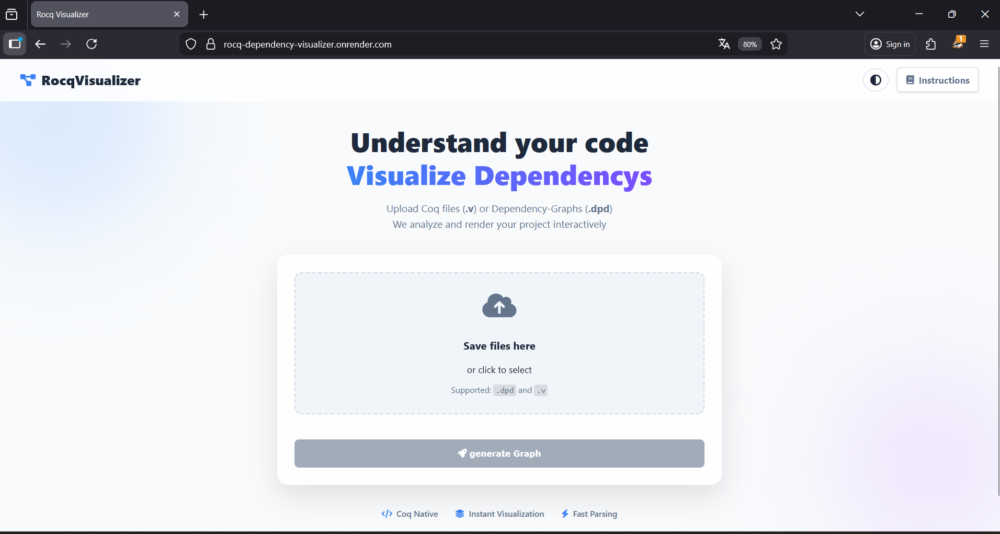
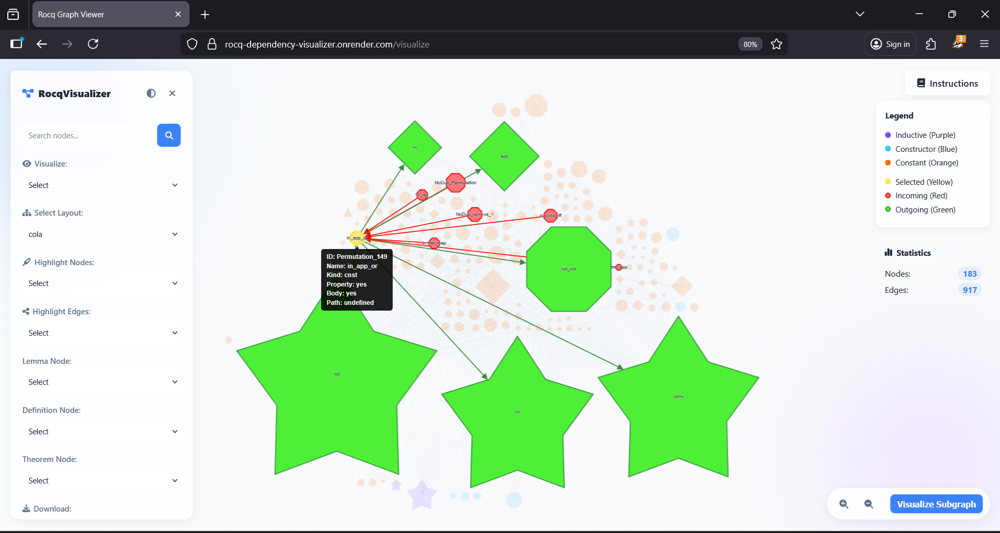
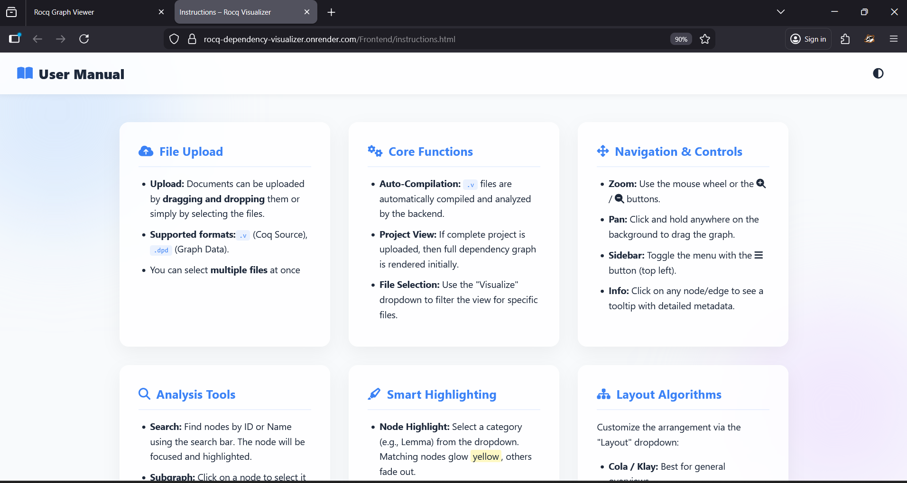

# Rocq Dependency Visualizer

A web-based tool that automatically analyzes and visualizes dependency graphs for **Rocq** (formerly Coq) projects. Upload `.v` source files or `.dpd` dependency files and explore your project's structure interactively.

🌐 **Live Demo:** [rocq-dependency-visualizer.onrender.com](https://rocq-dependency-visualizer.onrender.com)
> ⚠️ Hosted on Render free tier — may be unavailable if the monthly usage limit is reached.

---

##  Screenshots

<p align="center">
  
</p>

<p align="center">
  
</p>

<p align="center">
  
</p>

---

##  Motivation

In large Rocq projects, dependencies between modules can grow complex quickly — making maintenance and refactoring difficult. This tool automatically parses those dependencies and presents them as an interactive, navigable graph, helping developers and researchers better understand their proof structures.

---

##  Features

- Upload `.v` (Rocq source) or `.dpd` (dependency graph) files — supports multiple files at once
- Auto-compilation of `.v` files on the backend using `coqc`
- Interactive graph visualization powered by **Cytoscape.js**
- Node color-coding by kind: `inductive`, `constructor`, `constant`
- Search nodes by name or ID
- Highlight nodes/edges by declaration type: `Lemma`, `Theorem`, `Definition`, `Fixpoint`, and more
- Custom node coloring for Lemma, Definition, and Theorem nodes
- Graph statistics (node/edge count)
- Filter view by individual uploaded file
- Subgraph view — click a node to explore its direct neighbors in a new tab
- 11 layout algorithms: `cola`, `klay`, `dagre`, `fcose`, `cose-bilkent`, and more
- Export as PNG, SVG, PDF, or JSON
- Light/Dark theme toggle

---

##  Tech Stack

| Layer     | Technologies                                      |
|-----------|---------------------------------------------------|
| Backend   | Python, FastAPI, Starlette                        |
| Frontend  | HTML, CSS, JavaScript, Cytoscape.js               |
| Parsing   | Custom Python parsers (`Parser.py`, `RocqParser.py`) |
| Compiler  | Rocq / Coq (`coqc`), dpdgraph                    |
| Deploy    | Docker, Render                                    |

---

##  System Requirements

- Python 3.12.8+
- Packages: `fastapi`, `starlette`, `pytest`, `pytest-cov`
- Internet connection (layout libraries loaded via CDN)
- **Rocq Prover** — required for `.v` file compilation:
  1. Download from [rocq-prover.org/install](https://rocq-prover.org/install)
  2. Install to `C:\` or `C:\Program Files\`
  3. Rename the folder to `Coq`
  4. Add the `bin` folder to your system `PATH`

---

##  Project Structure

```
project-root/
├── Backend/
│   ├── Server.py          # FastAPI server & API routes
│   ├── Parser.py          # .dpd file parser
│   └── RocqParser.py      # .v file declaration-type parser
├── Frontend/
│   ├── index.html         # Upload page
│   ├── graph-page.html    # Main graph viewer
│   ├── subgraph-page.html # Subgraph viewer
│   ├── instructions.html  # User manual
│   ├── error-page.html    # Error display
│   ├── script-*.js        # Page-specific JS logic
│   └── style-*.css        # Page-specific styles
├── Tests/                 # Test suite
├── htmlcov/               # Coverage report (generated)
├── docker-compose.yml
└── README.md
```

---

##  Running Locally

### Option 1 — FastAPI (Direct)

```bash
# Optional: activate virtual environment
env/Scripts/activate

# Start the server
fastapi dev Backend/Server.py
# or
python -m fastapi dev Backend/Server.py
```

Visit: [http://localhost:8000](http://localhost:8000)

---

### Option 2 — Docker

```bash
# Build and start
docker-compose up --build

# Visit
http://localhost:8000/

# Stop and remove
docker-compose down
```

> Requires [Docker Desktop](https://www.docker.com/products/docker-desktop/) to be installed and running.

---

##  Running Tests & Coverage

```bash
# Run tests with coverage report
python -m pytest --cov=. --cov-report=html
```

Open `htmlcov/index.html` in your browser to view the coverage report.

---

##  How to Use

1. Open the app in your browser
2. Drag & drop or select `.v` or `.dpd` files
3. Click **Generate Graph**
4. Explore the graph — click nodes, change layouts, highlight types
5. Use **Visualize Subgraph** to isolate a node and its neighbors
6. Export your graph as PNG, SVG, PDF, or JSON

> Click the **Instructions** button inside the tool for a full feature guide.

---

##  Contributors

Developed as a **Bachelor Project** at **RPTU Kaiserslautern** during Winter Semester 2025/26.

- Franziska Schajor
- [Leyla Munyana](https://github.com/Leyla1203)
- [Devashish Pisal](https://github.com/Devashish-Pisal) 

---

